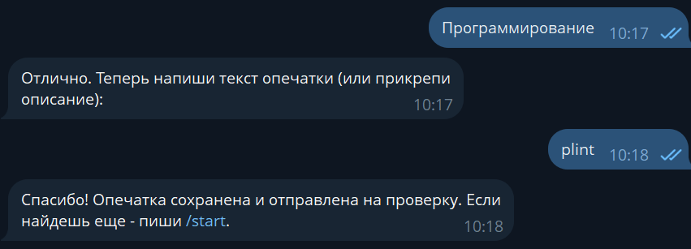
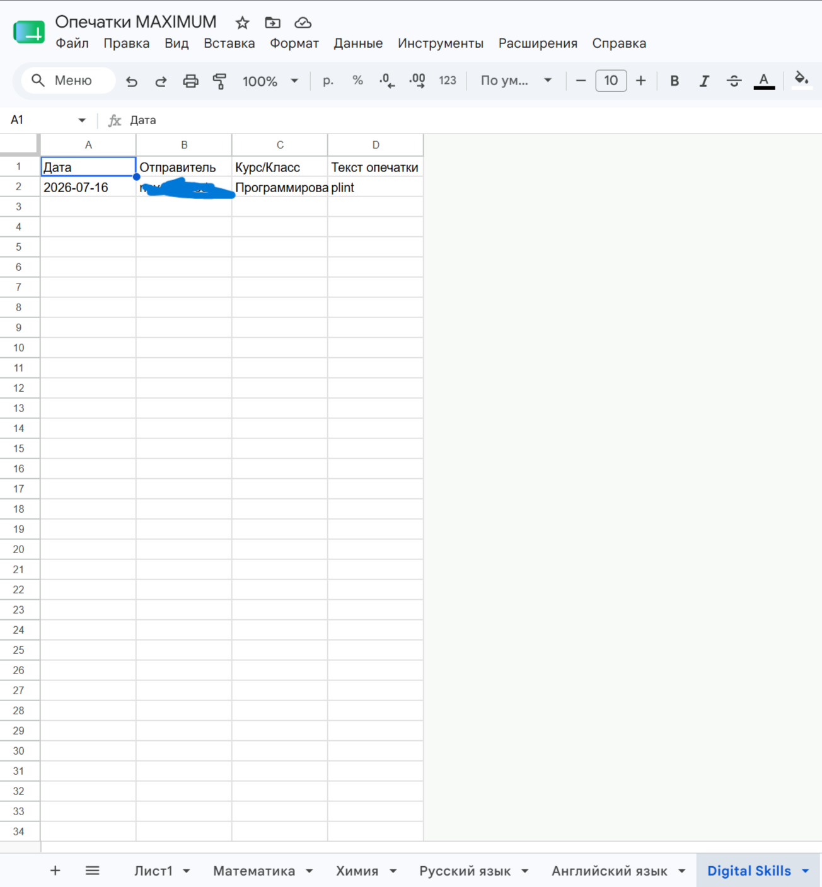

# Telegram Typo Reporter Bot

Telegram-бот для сбора сообщений об опечатках и сохранения данных в Google Sheets.

## О проекте

Бот создан на Python для удобного сбора информации об ошибках в учебных материалах.

Пользователь может:
- выбрать предмет;
- выбрать направление курса или класс;
- отправить текст найденной ошибки;
- автоматически сохранить данные в Google Таблицу.

## Возможности

✅ Telegram-бот на Python  
✅ Кнопочное меню  
✅ Сохранение данных в Google Sheets  
✅ Разделение данных по предметам  
✅ Работа с API Telegram и Google

## Использованные технологии

- Python
- pyTelegramBotAPI
- Google Sheets API
- gspread

## Скриншоты работы

### Запуск бота

### Выбор курса

### Сохранение ошибки

### Google Sheets

